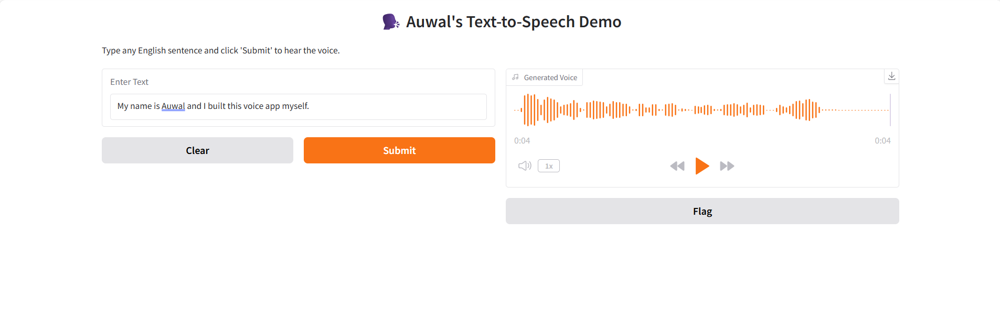

# 🗣️ Auwal's Text-to-Speech App

This is a simple Text-to-Speech (TTS) demo built using [Coqui TTS](https://github.com/coqui-ai/TTS) and [Gradio](https://www.gradio.app/). It takes user input and converts it into synthetic speech using a pretrained Tacotron2 model.

## 🚀 Demo
## 🔗 Live Demo

👉 [Click here to try the app](https://huggingface.co/spaces/mrAhmad47/tts-demo)

Run the app locally and test it in your browser.



## ✨ Features

- ✅ Converts text to natural-sounding speech
- ✅ Uses a pretrained neural model (Tacotron2-DDC)
- ✅ Runs entirely offline
- ✅ Interactive Gradio web interface
- ✅ Built using Python, Coqui TTS, and Gradio

## 📦 Setup Instructions

1. Clone this repo:
   ```bash
   git clone https://github.com/<your-username>/tts-demo.git
   cd tts-demo
